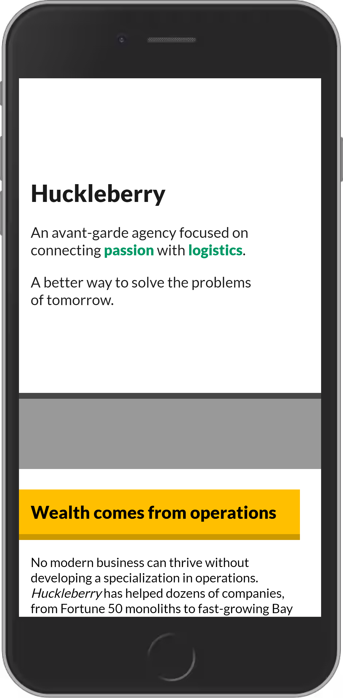
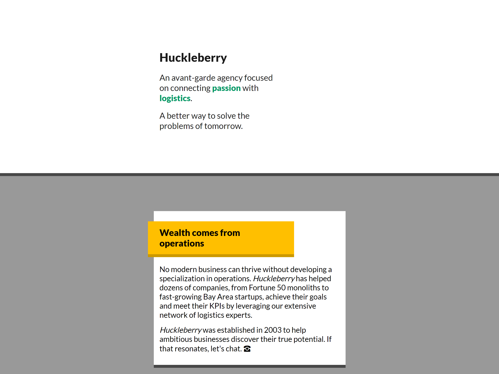

# Huckleberry Agency Website

In this workshop, I built a minimal landing page for an agency.

This mockup is built entirely using _flow layout_: no Flexbox, no grid, no absolute positioning. It relies heavily on padding, margin, and border.

## My Completed Work

I built page that looked like this:

Mobile:



Desktop:


## Mockups

We were asked to build this:


## Setup Instructions

This project uses Parcel, to provide a development server with lightning-quick hot-reload.

Start by installing dependencies:

```
npm install
```

Boot up a dev server:

```
npm run start
```


You can visit `http://localhost:1234` to view the page. You will see my work on this project.


**Workshops are submitted through the course platform.** Commit your changes, push them to your fork, and submit the link by clicking the "Complete lesson" button on the workshop page.

If you're not comfortable with Git, you can upload a `.zip` file using Dropbox or Google Drive, and paste a link to the public file instead.
